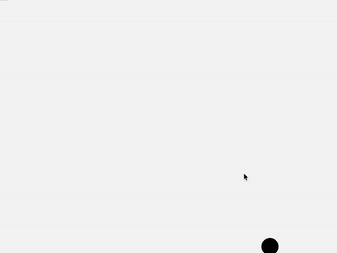

# Physics Engine
> Trying to solve some simple questions, combining physics and coding.
>> Mainly because I am interested in game making.

## A falling ball
*** A simple 2D physics simulation of a bouncing ball, built with C++ and the Raylib library. ***

### Features
* Gravity: The ball accelerates downwards, simulating gravity.

* Collision: The ball bounces when touch the window, rebounding with some of its enrgy losing.

* Interaction: Drag/ throw the ball with mouse.

### Demo
* Source code: [a falling ball](PhysicsEngine/A falling ball/main.cpp)
* GIF: 
